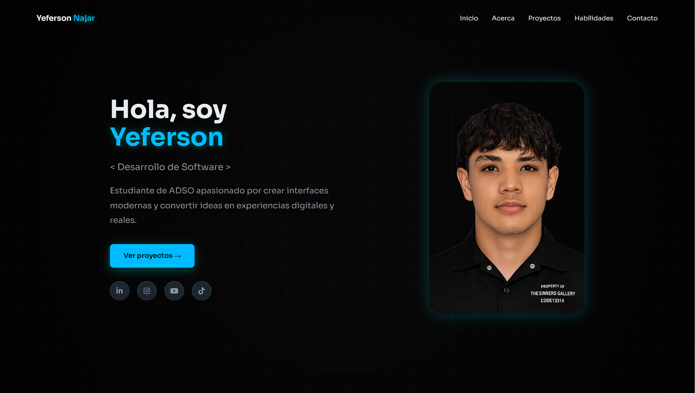

# Portafolio Web -  Yeferson 

Bienvenido a mi portafolio personal.  
Este proyecto fue desarrollado para mostrar mis habilidades como diseños, mis proyectos y formas de contacto.

---

## 🌐 Demo

 Puedes verlo aquí:  
[Ver Portafolio](--)

---

##  Tecnologías Utilizadas

- HTML5
- CSS (Animaciones)
- JavaScript
- Diseño Responsive
- Animaciones con Scroll

---

##  Características

- Diseño moderno estilo oscuro  
- Animaciones suaves de aparición (scroll reveal)  
- Sección de proyectos dinámica  
- Sección de contacto interactiva  
- Efectos hover profesionales  
✔ Totalmente responsive  

---

##  Estructura del Proyecto
/portafolio
│── index.html
│── estilos.css
│── asset

##  Contacto

Si deseas trabajar conmigo o tienes alguna propuesta:

     Email: yefernjr@gmail.com 
     
     LinkedIn: [https://www.linkedin.com/in/yeferson-najar-b583113b1/]  
     
     GitHub: [https://github.com/yeferstack]

---

##  Vista Previa

---

##  Aprendizajes

Durante este proyecto practiqué:

- Organización profesional de código
- Animaciones avanzadas con CSS
- Efectos de transición personalizados

